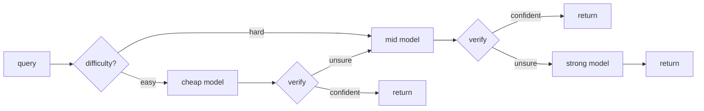

# cascade — route each LLM call to the cheapest model that will get it right

[](https://github.com/darrshangovender/cascade/actions/workflows/tests.yml)
[](LICENSE)
[](https://python.org)
[](https://anthropic.com)

> A verifier-gated **model cascade**: send each query to the cheapest model first, **verify** the answer, and **escalate** to a stronger model only when verification fails. An offline threshold optimizer fits the escalation gates to hit a target accuracy at minimum cost.

**Why this exists.** The default way to use LLMs is "pick one model, send it everything." But most queries are easy — a small model nails them — and only a minority are hard enough to need a frontier model. Paying frontier prices for every query is the single biggest avoidable line item in most LLM budgets. `cascade` spends the expensive model only where it earns its cost.

**One of four on inference economics:** `cascade` (route to the cheapest model) · [thinking-loop](https://github.com/darrshangovender/thinking-loop) (spend more when it's hard) · [context-compress](https://github.com/darrshangovender/context-compress) (shrink the input) · [guardrail](https://github.com/darrshangovender/guardrail) (validate both ends).

---

## The result

Reproduce with `python benchmarks/run.py` — 150-item train / 200-item test, seeds 1 and 2, fully offline on a deterministic mock, no API keys:

| strategy | accuracy | cost / query | vs strong |
|---|---|---|---|
| cheap-only (mini) | 61.0% | $0.000003 | — |
| mid-only (sonnet) | 80.0% | $0.000070 | — |
| strong-only (opus) | **93.5%** | $0.000351 | baseline |
| **cascade (calibrated)** | **88.0%** | **$0.000231** | **−34% cost, 94% of accuracy** |

The cascade averages **1.69 model calls per query** — most stop at the cheap or mid tier.

**Read this honestly.** These numbers characterise `MockLLM`, not GPT-4o-mini or Opus. Correctness is drawn from a logistic function of `skill − difficulty` with skills fixed at 0.40 / 0.65 / 0.92 and a 60/25/15 difficulty mix. What the benchmark demonstrates is that *the mechanism* — verify, gate, escalate, calibrate — converts a cost/accuracy gap into a Pareto curve. It does not tell you what you will save on your traffic. No results file is committed; run it yourself.

The calibrator walks that curve (`python examples/calibration_demo.py`):

```
target=0.60 [MET]  thresholds=(0.00, 0.00)  acc=0.662  cost=$0.00016/q
target=0.75 [MET]  thresholds=(0.70, 0.00)  acc=0.800  cost=$0.00027/q
target=0.90 [MET]  thresholds=(0.85, 0.70)  acc=0.900  cost=$0.00036/q
```

## Quick start

```bash
pip install -e ".[dev]"      # zero runtime dependencies
python examples/quickstart.py
```

```python
from cascade import Router, Tier, ThresholdPolicy
from cascade.llm import MockLLM                 # swap for AnthropicLLM / OpenAILLM
from cascade.verifiers import ConsistencyVerifier, SelfCheckVerifier, RuleVerifier

cheap  = MockLLM("gpt-4o-mini",       tier=0, skill=0.40)
mid    = MockLLM("claude-sonnet-4-5", tier=1, skill=0.65)
strong = MockLLM("claude-opus-4-7",   tier=2, skill=0.92)

router = Router(
    tiers=[
        Tier(cheap,  ConsistencyVerifier(cheap, n=5)),  # cheap samples ≈ free
        Tier(mid,    SelfCheckVerifier(mid)),           # one extra call
        Tier(strong, RuleVerifier()),                   # top tier: always accept
    ],
    policy=ThresholdPolicy([0.7, 0.6, 0.0]),            # calibrate these
)

result = router.route("What is the capital of France?")
print(result.answer, result.final_tier, result.total_cost_usd)
```

## How it works



1. **Estimate difficulty** to pick the entry tier — easy starts cheap, hard skips a doomed cheap call.
2. **Answer at the current tier**, then **verify** into a `Verdict(passed, confidence)`.
3. **The policy decides**: `confidence ≥ threshold` accepts and returns; otherwise escalate.
4. **The budget charges every model *and verifier* call** (cost, latency, call count).
5. On budget exhaustion, return the highest-confidence step seen rather than the last one attempted.
6. Return a `RouteResult` with the answer, the winning tier, the full step trace, and honest end-to-end cost.

## The verifier is the whole game

A cascade is only as good as its ability to know when the cheap model was wrong. Four ship, trading cost against reliability:

| Verifier | Extra calls | Signal | Use on |
|---|---|---|---|
| `RuleVerifier` | 0 | Structural: non-empty, no refusal marker, regex/predicate | pre-filter; top tier |
| `SelfCheckVerifier` | 1 | Model grades its own answer (the generation–verification gap) | mid tiers |
| `ConsistencyVerifier` | N−1 | Modal-answer agreement across N samples | cheap tiers (samples ≈ free) |
| `JudgeVerifier` | 1 (stronger) | A stronger model scores 0–10 | penultimate tier |

The cost intuition matters: at roughly `mini : sonnet : opus ≈ 1 : 20 : 100` per token, consistency-at-5 is nearly free on the cheap model but costs a whole strong call on the mid one. So the benchmark uses consistency on cheap and self-check on mid.

## Design decisions

| Decision | Why |
|---|---|
| **Verifier calls are charged to the budget** | A consistency check at n=5 costs about five model calls — real money. Accounting that ignored it would make the calibrator pick cost-blind thresholds. |
| **Offline deterministic `MockLLM`** | Tests *and* the benchmark run with zero API keys, so anyone can reproduce the repo. The mock role-plays both answerer and grader. |
| **Difficulty sets the entry tier, not the answer** | Cheap to compute, and being wrong only costs one extra escalation. The verifiers are the real safety net. |
| **Pareto frontier, not a single point** | "Best" depends on your accuracy target. The optimizer hands you the whole curve and the cheapest point that clears your bar. |
| **Provider clients lazily imported** | `import cascade` never requires the Anthropic or OpenAI SDK. |

## Limitations

- **`IndexError` on a first-tier budget breach.** If `budget.charge()` raises on the very first tier, the loop breaks before any `Step` is appended, so both `best_step` and `steps` are empty and `Router.route` raises. Reachable with any `Budget(max_cost_usd=...)` tighter than one cheap call. Real bug, not a caveat.
- **Grading is bidirectional substring containment**, so numeric answers grade wrong: gold `"4"` against answer `"42"` scores correct, and the mock's plausible-wrong generator produces `gold ± 1` for digits. Accuracy on the numeric benchmark is inflated by an unmeasured amount.
- **`ConsistencyVerifier` degenerates to whole-string equality on prose.** Its normaliser returns the first matched number if one exists, else the entire lowercased string. On free-form answers, agreement collapses and the verifier always escalates — the cheap tier is effectively disabled on non-numeric workloads.
- **Calibration is brute-force grid search over full-dataset simulations, single-threaded, no early stop.** Three tiers on the default six-point grid is 36 full passes; five tiers is 1296. The Pareto filter is additionally O(n²).
- **`HeuristicDifficulty` is uncalibrated constants with substring cue matching.** Cues are raw `in` checks weighted at 0.50, so "how many" fires on "how many days until my order ships" and one accidental hit dominates the score.
- **No retry, timeout, or error handling on the real provider clients.** A transient API error escapes the cascade rather than triggering escalation or budget-aware degradation.
- **`price_of` silently invents a price** — unknown models fall back to `(0.001, 0.002)`, so all cost accounting, and therefore every calibration decision, is quietly fabricated for any model outside the five-entry table.

## Project layout

```
cascade/
├── cascade/
│   ├── llm.py              # provider-portable clients + deterministic MockLLM
│   ├── difficulty.py       # heuristic + LLM difficulty estimators
│   ├── cascade.py          # the tier-by-tier executor
│   ├── router.py           # top-level entry point (difficulty → cascade)
│   ├── policy.py           # escalation policies (threshold, baselines)
│   ├── calibration.py      # offline Pareto-frontier threshold optimizer
│   ├── budget.py           # cost / latency / call-count guards
│   └── verifiers/          # rules · self-check · consistency · judge
├── benchmarks/             # reproducible offline benchmark + seeded dataset
├── examples/               # quickstart · calibration_demo
├── tests/                  # 38 tests, all offline
└── docs/                   # architecture · verifiers · calibration
```

## Tests

```bash
make test        # 38 tests, offline, no API keys
make benchmark   # reproduce the cost/accuracy table above
make calibrate   # print the Pareto frontier
```

CI runs the suite and the benchmark on every push.

## Author

Darrshan Govender · [Agulhas Code](https://agulhascode.co.za) · Durban, South Africa
