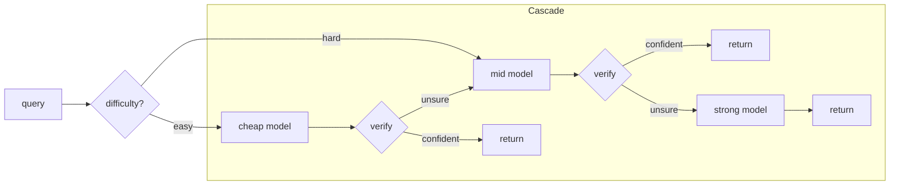

<div align="center">

# cascade — route each LLM call to the cheapest model that will get it right

[](https://github.com/darrshangovender/cascade/actions/workflows/tests.yml)
[](LICENSE)
[](https://python.org)
[](https://anthropic.com)
[](https://platform.openai.com)
[](#)

</div>

---

> A verifier-gated **model cascade**: send each query to the cheapest model first,
> **verify** the answer, and **escalate** to a stronger (pricier) model only when
> verification fails. An offline **threshold optimizer** fits the escalation gates
> to hit a target accuracy at minimum cost. Result on the shipped benchmark:
> **94% of the strongest model's accuracy at 34% lower cost**, resolving most
> queries in **under two model calls**.

**Why this exists.** The default way to use LLMs is "pick one model, send it
everything." But most queries are easy — a small model nails them — and only a
minority are hard enough to need a frontier model. Paying frontier prices for
every query is the single biggest avoidable line item in most LLM budgets.
`cascade` spends the expensive model only where it earns its cost.

> **Companion to [thinking-loop](https://github.com/darrshangovender/thinking-loop).**
> thinking-loop spends *more* compute when a question is hard. `cascade` spends
> *less* when it's easy. Same lever — inference-time compute — pulled in opposite
> directions. Use both: cascade to route, thinking-loop as a tier for the hard tail.

---

## The result

Reproducible benchmark (200-item held-out set, `python benchmarks/run.py`, runs
fully offline on a deterministic mock so anyone can re-run it with no API keys):

| strategy | accuracy | cost / query | vs strong |
|---|---|---|---|
| cheap-only (mini) | 61.0% | $0.000003 | — |
| mid-only (sonnet) | 80.0% | $0.000070 | — |
| strong-only (opus) | **93.5%** | $0.000351 | baseline |
| **cascade (calibrated)** | **88.0%** | **$0.000231** | **−34% cost, 94% of accuracy** |

The cascade answers **1.69 model calls per query on average** — most queries stop
at the cheap or mid tier, and only the hard tail reaches the expensive model.

You choose where to sit on the accuracy/cost frontier. From the calibrator
(`python examples/calibration_demo.py`):

```
target=0.60 [MET]  thresholds=(0.00, 0.00)  acc=0.662  cost=$0.00016/q
target=0.75 [MET]  thresholds=(0.70, 0.00)  acc=0.800  cost=$0.00027/q
target=0.90 [MET]  thresholds=(0.85, 0.70)  acc=0.900  cost=$0.00036/q
```

Accuracy and cost rise together, monotonically — the optimizer walks the Pareto
frontier and hands you the cheapest point that meets your target.

---

## How it works



1. **Estimate difficulty** → pick the entry tier (easy starts cheap; hard skips a
   doomed cheap call).
2. **Answer at the current tier**, then **verify** — a `Verdict(passed, confidence)`.
3. **Policy decides**: `confidence ≥ threshold` → accept and return; else escalate.
4. **Budget guards** every model *and verifier* call (cost / latency / call caps).
5. Return a `RouteResult` with the answer, the winning tier, the full trace, and
   honest end-to-end cost.

---

## Quick start

```bash
pip install -e ".[dev]"      # or: uv sync
python examples/quickstart.py
```

```python
from cascade import Router, Tier, ThresholdPolicy
from cascade.llm import MockLLM                 # swap for AnthropicLLM / OpenAILLM
from cascade.verifiers import ConsistencyVerifier, SelfCheckVerifier, RuleVerifier

cheap  = MockLLM("gpt-4o-mini",      tier=0, skill=0.40)
mid    = MockLLM("claude-sonnet-4-5", tier=1, skill=0.65)
strong = MockLLM("claude-opus-4-7",   tier=2, skill=0.92)

router = Router(
    tiers=[
        Tier(cheap,  ConsistencyVerifier(cheap, n=5)),  # cheap samples ≈ free
        Tier(mid,    SelfCheckVerifier(mid)),           # one extra call
        Tier(strong, RuleVerifier()),                   # top tier: always accept
    ],
    policy=ThresholdPolicy([0.7, 0.6, 0.0]),            # calibrate these
)

result = router.route("What is the capital of France?")
print(result.answer, result.final_tier, result.total_cost_usd)
# Paris 0 2e-05   ← resolved at the cheapest tier
```

Going to production? Swap `MockLLM` for the real providers:

```python
from cascade.llm import AnthropicLLM, OpenAILLM
cheap  = OpenAILLM("gpt-4o-mini", tier=0)
strong = AnthropicLLM("claude-opus-4-7", tier=2)
```

---

## The verifier is the whole game

A cascade is only as good as its ability to *know when the cheap model was wrong.*
Four verifiers ship, trading cost against reliability:

| Verifier | Extra calls | Signal | Use on |
|---|---|---|---|
| `RuleVerifier` | 0 | Structural: non-empty, no refusal, regex/schema/predicate | pre-filter; top tier |
| `SelfCheckVerifier` | 1 | Model grades its own answer (the generation–verification gap) | mid tiers |
| `ConsistencyVerifier` | N−1 | Agreement across N samples | cheap tiers (samples ≈ free) |
| `JudgeVerifier` | 1 (stronger) | A stronger model scores 0–10 | penultimate tier |

The cost intuition matters: with `mini : sonnet : opus ≈ 1 : 20 : 100` per token,
consistency-at-5 is nearly free on the cheap model but costs a whole strong call
on the mid model. So the benchmark uses **consistency on cheap, self-check on
mid** — the cost/signal sweet spot. Full reasoning in [docs/verifiers.md](docs/verifiers.md).

---

## Calibration — the analytical core

Thresholds are the knobs; picking them by hand is guesswork. `calibrate()` does it
properly:

```python
from cascade.calibration import calibrate, CalibrationItem

result = calibrate(cascade_factory, labelled_items, n_tiers=3, target_accuracy=0.90)
print(result.chosen.thresholds)     # cheapest thresholds hitting 90% accuracy
print(result.chosen.mean_cost_usd)  # what that costs
```

It sweeps a threshold grid, simulates the cascade over a labelled set, filters to
the **accuracy/cost Pareto frontier**, and returns the cheapest point meeting your
target (or the most accurate one, flagged, if none do). Deterministic and
reproducible offline. See [docs/calibration.md](docs/calibration.md).

---

## When to use this (and when not to)

**Use it when** your traffic is a mix of easy and hard queries (almost all real
traffic is), you're paying frontier prices for everything, and you can produce a
small labelled set to calibrate against.

**Skip it when** every query genuinely needs your best model (verification
overhead only adds cost), or you can't tolerate the extra tail latency of an
escalation on hard queries.

---

## Design decisions

| Decision | Why |
|---|---|
| **Verifier calls are charged to the budget** | A consistency check at n=5 costs ~5 model calls — real money. Accounting that ignored it would make calibration pick cost-blind thresholds. |
| **Offline deterministic `MockLLM`** | Tests *and* the benchmark run with zero API keys, so the repo is reproducible by anyone. The mock role-plays both answerer and grader. |
| **Difficulty sets the entry tier, not the answer** | Cheap to compute, and being wrong only costs one extra tier of escalation — the verifiers are the real safety net. |
| **Pareto frontier, not a single point** | "Best" depends on your accuracy target. The optimizer hands you the whole curve and the cheapest point that meets your bar. |
| **Provider-portable clients, lazily imported** | `import cascade` never requires the Anthropic/OpenAI SDKs; you only pay for what you use. |

---

## Project layout

```
cascade/
├── cascade/
│   ├── llm.py              # provider-portable clients + deterministic MockLLM
│   ├── difficulty.py       # heuristic + LLM difficulty estimators
│   ├── cascade.py          # the tier-by-tier executor
│   ├── router.py           # top-level entry point (difficulty → cascade)
│   ├── policy.py           # escalation policies (threshold, baselines)
│   ├── calibration.py      # offline Pareto-frontier threshold optimizer
│   ├── budget.py           # cost / latency / call-count guards
│   ├── types.py            # Query, Verdict, Step, RouteResult
│   └── verifiers/          # rules · self-check · consistency · judge
├── examples/               # quickstart · calibration_demo
├── benchmarks/             # reproducible offline benchmark + dataset
├── tests/                  # 38 tests, all offline
└── docs/                   # architecture · verifiers · calibration
```

## Tests

```bash
make test        # 38 tests, all offline, no API keys
make benchmark   # reproduce the cost/accuracy table above
make calibrate   # print the Pareto frontier
```

CI runs the suite + the benchmark on every push (`.github/workflows/tests.yml`).

## Author

Darrshan Govender · [Agulhas Code](https://agulhascode.co.za) · Durban, South Africa
